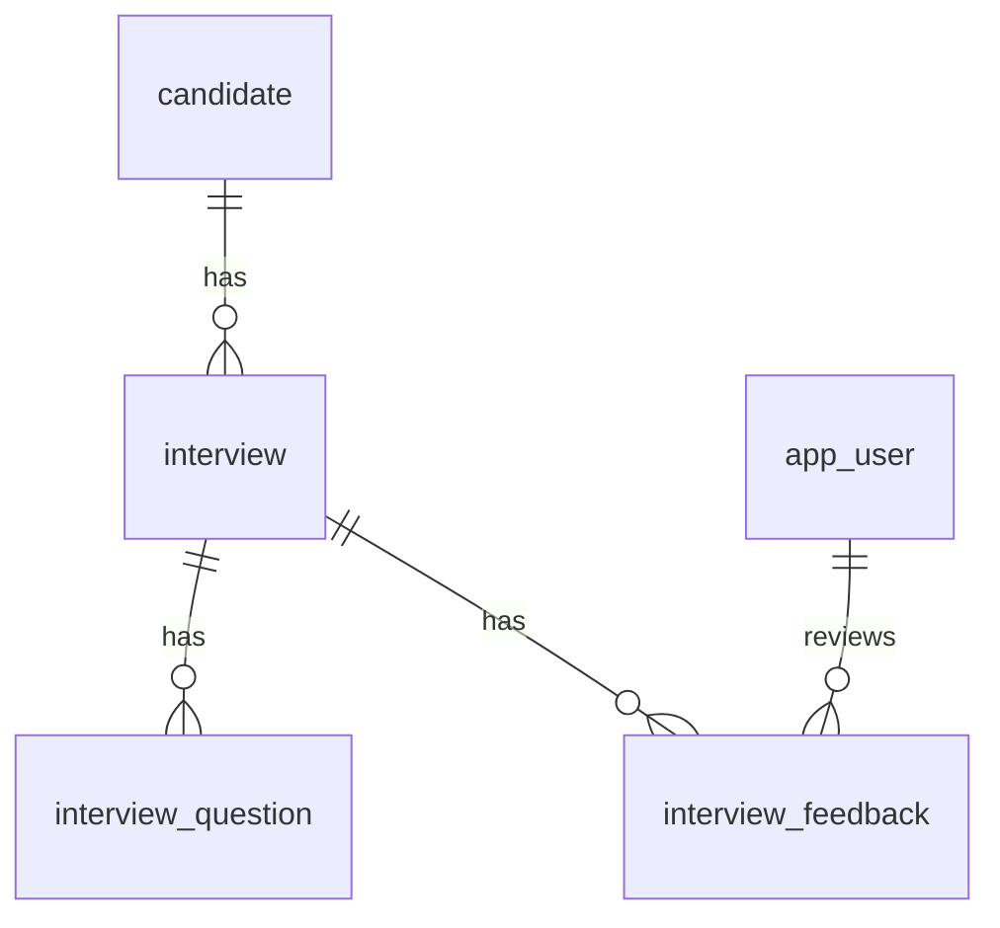

# Database Schema

Этот документ описывает текущую схему PostgreSQL. Источник истины для применения схемы — Flyway migrations в `backend/src/main/resources/db/migration`.

## Current Migration

- `V1__init_schema.sql`

## Extensions

### pgcrypto

Используется для генерации UUID через `gen_random_uuid()`.

## Tables

### app_user

Пользователь системы.

| Column | Type | Nullable | Default | Notes |
|---|---|---:|---|---|
| id | uuid | no | gen_random_uuid() | Primary key |
| email | varchar(255) | no |  | Unique |
| display_name | varchar(160) | no |  | Display name |
| role | varchar(40) | no |  | Role name |
| created_at | timestamptz | no | now() | Creation timestamp |

### candidate

Кандидат, для которого проводится интервью.

| Column | Type | Nullable | Default | Notes |
|---|---|---:|---|---|
| id | uuid | no | gen_random_uuid() | Primary key |
| full_name | varchar(180) | no |  | Candidate full name |
| email | varchar(255) | yes |  | Candidate email |
| target_role | varchar(160) | yes |  | Target role |
| created_at | timestamptz | no | now() | Creation timestamp |

### interview

Интервью кандидата.

| Column | Type | Nullable | Default | Notes |
|---|---|---:|---|---|
| id | uuid | no | gen_random_uuid() | Primary key |
| candidate_id | uuid | no |  | FK to `candidate(id)` |
| title | varchar(220) | no |  | Interview title |
| status | varchar(40) | no |  | Status value |
| scheduled_at | timestamptz | yes |  | Scheduled time |
| created_at | timestamptz | no | now() | Creation timestamp |

### interview_question

Вопрос интервью.

| Column | Type | Nullable | Default | Notes |
|---|---|---:|---|---|
| id | uuid | no | gen_random_uuid() | Primary key |
| interview_id | uuid | no |  | FK to `interview(id)` with cascade delete |
| prompt | text | no |  | Question text |
| expected_level | varchar(40) | yes |  | Expected candidate level |
| sort_order | integer | no | 0 | Ordering inside interview |

### interview_feedback

Обратная связь по интервью.

| Column | Type | Nullable | Default | Notes |
|---|---|---:|---|---|
| id | uuid | no | gen_random_uuid() | Primary key |
| interview_id | uuid | no |  | FK to `interview(id)` with cascade delete |
| reviewer_id | uuid | yes |  | FK to `app_user(id)` |
| score | integer | yes |  | Check: 1..5 |
| summary | text | yes |  | Feedback summary |
| created_at | timestamptz | no | now() | Creation timestamp |

## Relationships

## Indexes

| Index | Table | Columns |
|---|---|---|
| idx_interview_candidate_id | interview | candidate_id |
| idx_interview_question_interview_id | interview_question | interview_id |
| idx_interview_feedback_interview_id | interview_feedback | interview_id |

## Change Rules

- Новые изменения схемы добавлять новой Flyway migration, не редактировать уже примененную migration после появления данных.
- При добавлении таблицы обновлять этот документ.
- При добавлении связи указывать expected delete behavior.
- При добавлении enum-like поля фиксировать допустимые значения в `business/` или `development-specs.md`.

## Open Questions

- Нужно ли добавить audit поля `updated_at`, `created_by`, `updated_by`?
- Нужно ли использовать database enum для статусов и ролей?
- Нужно ли добавить soft delete?
